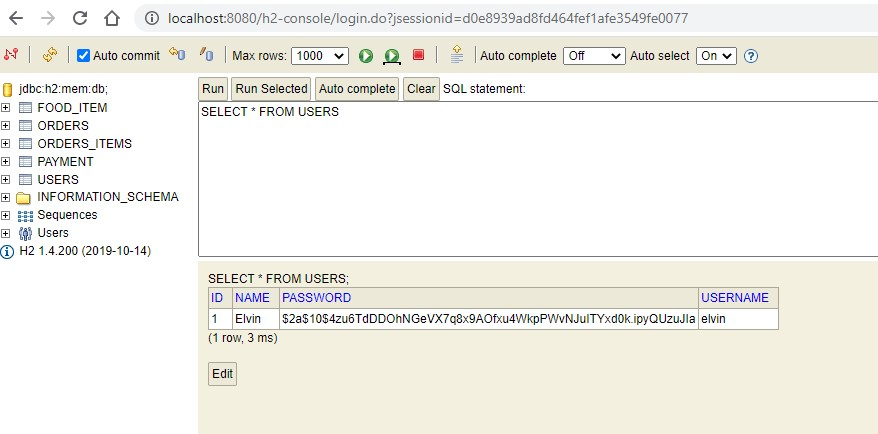
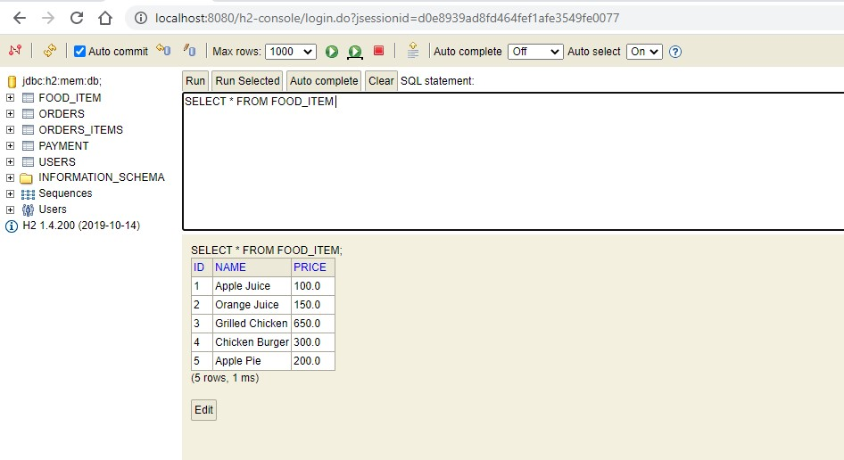

# Restaurant Management System - Spring Boot Backend

## Tech stack overview

* Uses Spring Security OAuth legacy stack.
* Uses JWT Token Store.
* Uses H2 in-memory database.
* Spring Data JPA and Hibernate with a relational database.

---

## App overview

* Executes SQL patch files for initial database records for the tables `food_item` and `users`.

  * Table `users`\
  
  
  * Table `food_item`\
    

* Every endpoint matching `/api/**` must be authenticated.

---

## Angular App

You can use this [Angular app](https://github.com/elwyncrestha/ng-rms) which consumes the APIs that this application provides.
